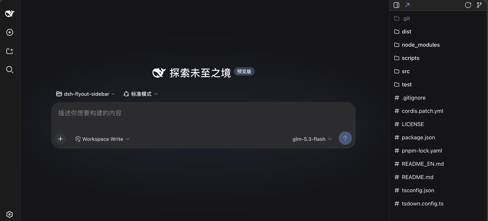
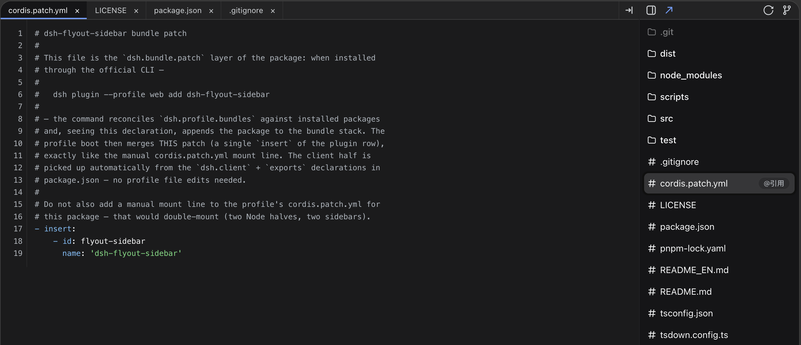
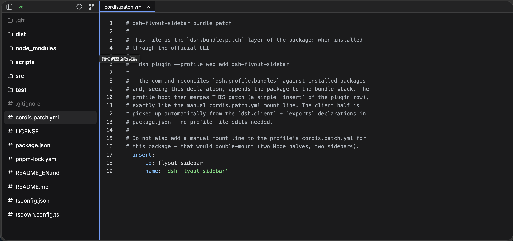

# dsh-flyout-sidebar

[](https://www.npmjs.com/package/dsh-flyout-sidebar)
[](#license)

> DeepSeek Harness (DSH) 插件：**可弹出式侧边栏**——文件树 + Git 未提交变更列表，多标签预览文件与 diff，预览区盖住整个会话区，还能一键**弹出为独立浏览器标签页**、拖到另一块显示器。
>
> 中文 ｜ [EN](README_EN.md)



## 安装 / Install

### npm 安装（推荐）

```sh
dsh plugin --profile web add dsh-flyout-sidebar
```

### 源码安装（GitHub）

```sh
dsh plugin --profile web add github:oxlyn/dsh-flyout-sidebar
```

### 本地安装（开发）

```sh
git clone https://github.com/oxlyn/dsh-flyout-sidebar.git
cd dsh-flyout-sidebar
npm install
npm run build          # tsdown → dist/index.js + dist/client.js

# 在插件的父目录执行（dsh plugin add 的相对路径锚定调用目录）：
cd ..
dsh plugin --profile web add ./dsh-flyout-sidebar   # 符号链接安装；改 src/ 后 npm run build 并重启 dsh web 即可生效
dsh web
```

### 验证 / Verify

装完**重启 `dsh web`** 并**硬刷新浏览器**（Cmd/Ctrl+Shift+R），界面右上角应出现常驻侧边栏图标按钮（无会话时也可见）。也可验证配置层：

```sh
dsh --profile web --dump-config | grep dsh-flyout-sidebar   # 配置层含本行
```

## 核心特性 / Highlights

- **可弹出**：面板左上角 ↗ 一键弹出为 `/flyout-sidebar` 独立浏览器标签页——可拖到另一块显示器当"文件面板"用，主屏对话不受任何遮挡；面板与弹出页经 `localStorage` 实时同步会话与主题，弹出页无标题栏、垂直空间全部留给内容
- **预览显示面积大**：预览覆盖层盖住侧边栏**左侧整个会话区域**（不是挤在窄面板里），代码行号 + 语法高亮、长文件、大图、PDF 都有足够的阅读宽度
- **多标签预览文件 / diff**：可同时打开多个文件标签，也可直接点 Git 变更列表打开**着色 unified diff**；支持代码高亮、Markdown 渲染、图片、PDF（内嵌 pdf.js，离线可用）、HTML 沙箱 iframe；⇥ 一键收起/恢复全部标签
- **自动刷新**：Git 变更列表自动跟随——agent 每次工具执行后 700ms 去抖刷新 + 2s 轮询 + 15s 兜底覆盖 IDE 等带外修改；点刷新按钮强制拉取真实状态，列表逐行浮现提示



## 功能 / Features

| # | 形式 | 入口 | 说明 |
|---|------|------|------|
| 1 | 文件树视图（默认） | 面板打开即见 | 浏览当前工作区目录，懒加载展开、目录优先排序，实时跟随工作区/会话切换重新定位根目录；顶部搜索框按文件名过滤（`git ls-files` 秒搜全仓，尊重 gitignore） |
| 2 | Git 变更视图 | 面板右上角 git 分支图标 | 列出已变更未提交文件（`M`/`A`/`D`/`R`/`U` 徽章，悬停显示已暂存/未暂存，重命名显示原路径）；点击文件显示相对 HEAD 的着色 unified diff，未跟踪文件自动合成新文件 diff |
| 3 | 多标签预览 | 点击文件 | 预览覆盖层盖住侧边栏左侧整个区域，可同时打开多个文件；按扩展名自动语法高亮，另支持 Markdown 渲染、图片、PDF、HTML 沙箱 iframe；⇥ 收起整个预览（标签保留，点文件恢复） |
| 4 | 弹出独立标签页 | 面板左上角 ↗ | 弹出为 `/flyout-sidebar` 独立网页，可拖到另一显示器；内容在左/面板在右，面板左右位置一键切换、宽度可拖动（默认最小宽，记忆偏好） |

**其他特性一览：**

- 切换项目/会话时自动清空全部预览标签，杜绝跨项目内容串显
- git 变更行与文件树行可一键复制路径，或把 `@path` 引用写入会话输入框
- 面板与弹出页实时跟随 DSH 浅色 / 深色主题（弹出页经 `localStorage` 同步，首屏即正确）
- 与其他 sidebar 插件兼容：其他侧边卡片打开时自动让位到其左侧，两者同时可见
- 面板开合为推拉滑动动画，触发按钮随面板同步滑入滑出
- 中英双语界面：默认跟随浏览器语言，可在设置中固定；独立弹出页经 `localStorage` 同步语言选择



## 设置 / Settings

DSH 设置面板（左下角 ⚙️）新增「**Flyout Sidebar**」选项卡：

| 设置 | 默认 | 说明 |
|---|---|---|
| 默认展开 | 开 | 页面加载后侧边栏默认展开；关闭则默认收起 |
| 自动刷新 | 开 | Git 变更视图打开时每 2s 轮询最新状态 |
| 文件树 | 开 | 显示文件树视图与视图切换图标；关闭后面板固定显示 Git 变更视图 |
| 最短面板宽度 | 20% | 面板最小宽度（占窗口宽度的百分比，20–60%）；更宽可拖动面板左边缘调整 |
| 界面语言 | 跟随浏览器 | 侧边栏与独立弹出页的显示语言（中文 / English）；弹出页需刷新后生效 |

设置保存在浏览器 `localStorage`（键 `dsh-flyout-sidebar:settings`），刷新后仍生效；弹出页的面板宽度/左右位置偏好分别存于 `dsh-flyout-sidebar:panelw` / `panelLeft`。

## 实现方式 / How it works

插件分为 host 侧与 client 侧两部分，使用 TypeScript + JSX 编写，由 **tsdown** 打包成两个单文件 bundle：

```
┌─ host 侧 src/index.ts → dist/index.js（Node 进程，ESM）─────────┐
│  - host/artifacts.ts   产物跟踪（write/edit + shell 快照 diff） │
│  - host/git.ts         git status/diff（按工作区分桶缓存）      │
│      git status --porcelain=v1 -z   变更列表                    │
│      git diff HEAD -M -- <path>     着色 unified diff 文本      │
│  - host/workspace.ts   会话 → 工作区 cwd 解析（含缓存）         │
│  - host/files.ts       文件树列目录 / 文本读取                  │
│  - host/page.ts        独立弹出页 HTML（内联 shared 源码）       │
│  - host/routes.ts      ctx.webServer.register：                 │
│      GET /flyout-sidebar/gitstatus  变更列表 JSON（支持 force） │
│      GET /flyout-sidebar/gitdiff    单文件 diff JSON            │
│      GET /flyout-sidebar/listdir    文件树目录列表              │
│      GET /flyout-sidebar/content    文本内容（代码预览）        │
│      GET /flyout-sidebar/media      图片 / PDF 二进制           │
│  - tools/result 事件 → 700ms 去抖刷新对应工作区的状态缓存        │
└──────────────────────────────────────────────────────────────────┘
                          │ fetch
┌─ client 侧 src/client/index.tsx → dist/client.js（浏览器 IIFE）──┐
│  - React 组件（classic JSX 经 h 工厂编译；React 由 DSH 的        │
│    __ModuleLoader__ factory(require) 运行时提供，bundle 不内嵌） │
│  - shell.overlay：右上角常驻图标按钮 + 侧边栏面板                │
│  - 文件树 ⇄ Git 变更视图切换；多标签预览覆盖层（左侧全区域）     │
│  - settings.section：Flyout Sidebar 设置项                       │
│  - localStorage 跨页同步：当前会话 id、主题、面板偏好             │
└──────────────────────────────────────────────────────────────────┘
```

技术要点：`tsdown.config.ts` 一个配置打包两端（host ESM / client IIFE），自定义 `?raw` 插件在构建期把 shared 源码内联进独立弹出页的经典 `<script>`、把 vendored pdf.js 内嵌进 host bundle（离线可用）；shared 模块 `shared/ext.js`（预览类型）、`shared/highlight.js`（零依赖语法高亮）、`shared/markdown.js`（Markdown 渲染）以「可移植 JS + JSDoc 类型」书写，两端复用并随弹出页内联；host 依赖通过 `inject: ['webServer', 'sessionQuery', 'timer']` 声明。

## 环境要求 / Requirements

- Node `>=20`（DSH 宿主要求）
- `git` 在 PATH 中，且工作区为 git 仓库（否则 Git 变更视图显示错误提示，文件树不受影响）
- 本地构建需要 devDependencies（`tsdown`、`typescript` 等；运行时零依赖）

## 开发 / Development

```sh
npm run build         # tsdown 重新生成 dist/index.js 与 dist/client.js
npm run check         # tsc --noEmit 类型检查（strict）
npm test              # node:test smoke：host 路由/事件 + client 组件渲染 + 弹出页脚本
```

> 建议安装提交前守护（一次即可）：`ln -sf ../../scripts/precommit.sh .git/hooks/pre-commit`。每次 `git commit` 自动重建 bundle，产物与源码不同步会直接拦截提交。

项目结构：

```
dsh-flyout-sidebar/
├── tsdown.config.ts      # tsdown 构建：host/client 双 bundle + ?raw 内联插件
├── src/index.ts          # Host 入口（导出 name/inject/apply，ESM）
├── dist/                 # ⚙️ 构建产物：index.js（host）/ client.js（浏览器），勿手改
├── snapshots/            # README 截图
├── src/shared/           # 两端共享可移植模块（JSDoc 类型，随弹出页内联）：ext / markdown / highlight
├── src/host/             # host 模块：types / artifacts / workspace / files / git / page（弹出页 HTML）/ routes（HTTP）
├── src/client/           # client 模块（TSX）：jsx（React 桥）/ runtime / store / styles / icons / preview / components
├── src/vendor/pdfjs/     # vendored pdf.js（构建期内嵌，离线可用）
├── test/                 # node:test smoke 测试（对 dist 产物做黑盒验证）
└── cordis.patch.yml      # bundle 挂载补丁
```

## 更新 / Updates

```sh
dsh plugin --profile web update dsh-flyout-sidebar    # 或重新 add
```

随后重启 `dsh web` 并硬刷新浏览器。

> 若安装后仍是旧版本：DSH profile 的 pnpm 供应链策略 `minimumReleaseAge`（默认 24 小时）会暂缓安装刚发布的版本；可在 profile 的 `pnpm-workspace.yaml` 的 `minimumReleaseAgeExclude` 中加入本包名（不带版本号）立即解锁。

## 友情链接 / Links

- [LinuxDo](https://linux.do)

## License

[MIT](LICENSE)
